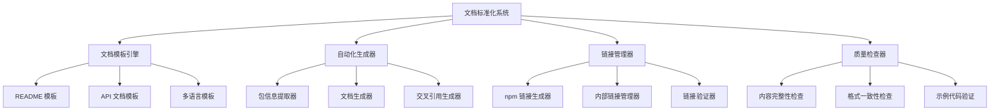
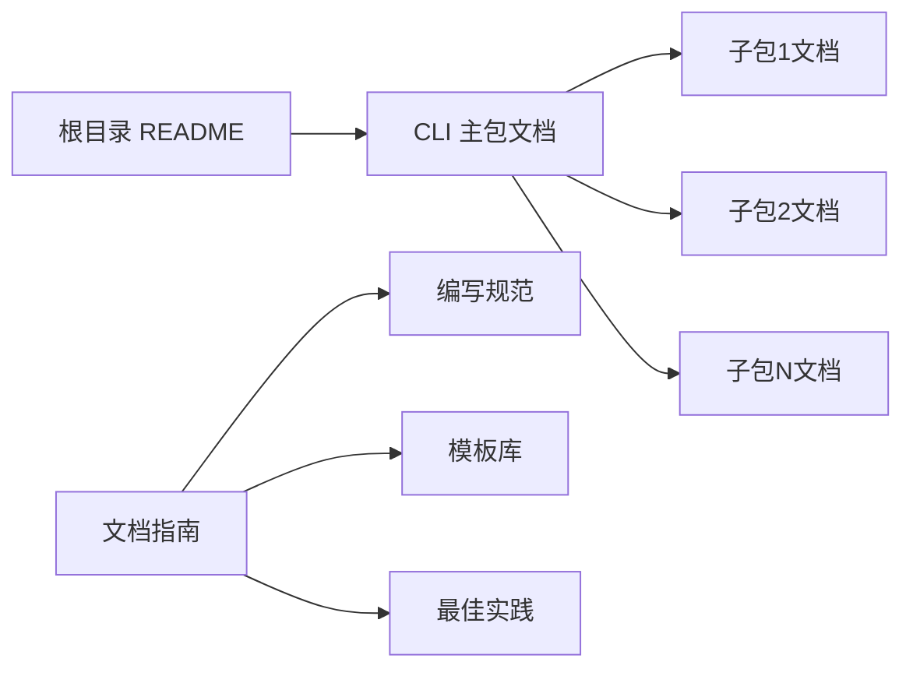

# 设计文档

## 概述

本设计文档描述了 done-coding CLI monorepo 项目的文档标准化系统。该系统将为所有子包建立统一的文档结构、格式规范和自动化维护流程，确保用户能够快速理解和使用各个工具包。

## 架构

### 整体架构



### 文档层次结构



## 组件和接口

### 1. 文档模板系统

#### 标准 README 模板结构
```markdown
# 包名

简短描述

## 安装

## 快速开始

## API 文档

## 示例

## 配置

## 故障排除

## 贡献指南

## 许可证
```

#### CLI 主包特殊结构
```markdown
# @done-coding/cli

done-coding 命令行工具集

## 安装

## 子命令概览

### git 命令
- 描述：git 跨平台操作工具
- 包地址：https://www.npmjs.com/package/@done-coding/cli-git
- 使用：`dc git <subcommand>`

### component 命令
- 描述：组件生成工具
- 包地址：https://www.npmjs.com/package/@done-coding/cli-component
- 使用：`dc component <subcommand>`

## 完整命令列表

## 配置

## 故障排除
```

### 3. 包依赖关系分析系统

#### 依赖关系分析器
```typescript
interface DependencyAnalyzer {
  analyzePackageDependencies(packageJsonPath: string): Promise<DependencyInfo>;
  buildDependencyGraph(packages: PackageInfo[]): DependencyGraph;
  identifyFunctionalCollaboration(packages: PackageInfo[]): CollaborationInfo[];
  validateDependencyConsistency(graph: DependencyGraph): ValidationResult;
}

interface DependencyInfo {
  runtime: Record<string, string>; // dependencies
  development: Record<string, string>; // devDependencies
  peer: Record<string, string>; // peerDependencies
  optional: Record<string, string>; // optionalDependencies
}

interface CollaborationInfo {
  consumer: string; // 调用方包名
  provider: string; // 提供方包名
  functionality: string; // 具体功能描述
  businessReason: string; // 业务需求驱动
  callPattern: 'direct' | 'indirect' | 'devtime'; // 调用模式
}

interface DependencyGraph {
  nodes: PackageNode[];
  edges: DependencyEdge[];
  collaborations: CollaborationInfo[];
}
```

#### 实际依赖关系（基于 package.json 分析）

**主 CLI 包依赖**:
- `@done-coding/cli` → 所有子包（runtime dependencies）
- 集成所有功能子包作为子命令

**功能包依赖层次**:
```
@done-coding/cli-utils (基础工具层)
├── @done-coding/cli-git (Git 操作)
├── @done-coding/cli-inject (信息注入)
├── @done-coding/cli-template (模板处理)
├── @done-coding/cli-extract (信息提取)
├── @done-coding/cli-publish (项目发布)
├── @done-coding/cli-config (工程配置)
└── @done-coding/cli-component (组件生成)

create-done-coding (项目创建)
├── @done-coding/cli-git
├── @done-coding/cli-inject  
├── @done-coding/cli-template
└── @done-coding/cli-utils

@done-coding/cli-component (组件生成)
├── @done-coding/cli-template
└── @done-coding/cli-utils

@done-coding/cli-extract (信息提取)
├── @done-coding/cli-template
└── @done-coding/cli-utils
```

**跨包功能协作**:
- `@done-coding/cli-config` ↔ `@done-coding/cli-git`: config 包的 merge-lint 模块调用 git 包的 check reverse-merge 功能
- `@done-coding/cli-inject` → 多个包: 作为 devDependency 为其他包提供构建时信息注入

#### 源代码分析器
```typescript
interface CodeAnalyzer {
  analyzeBinCommands(packagePath: string): Promise<BinCommandInfo[]>;
  extractExportedFunctions(packagePath: string): Promise<ExportInfo[]>;
  parseCliArguments(entryFile: string): Promise<ArgumentInfo[]>;
  detectAvailableOptions(commandFile: string): Promise<OptionInfo[]>;
}

interface BinCommandInfo {
  command: string;
  entryFile: string;
  description?: string;
  availableOptions: string[];
}

interface ExportInfo {
  name: string;
  type: 'function' | 'class' | 'interface' | 'type';
  signature: string;
  documentation?: string;
}
```

#### 实际功能验证器
```typescript
interface FunctionalityValidator {
  validateCommand(command: string, args: string[]): Promise<ValidationResult>;
  checkOptionExists(command: string, option: string): Promise<boolean>;
  extractHelpText(command: string): Promise<string>;
  verifyExampleCode(code: string, context: string): Promise<boolean>;
}
```

#### 包信息提取器
```typescript
interface PackageInfo {
  name: string;
  version: string;
  description: string;
  bin?: Record<string, string>;
  dependencies?: Record<string, string>;
  repository?: {
    type: string;
    url: string;
    directory?: string;
  };
}

interface SubcommandInfo {
  name: string;
  packageName: string;
  description: string;
  npmUrl: string;
  binCommand: string;
}
```

#### 文档生成器接口
```typescript
interface DocumentGenerator {
  generateMainReadme(packageInfo: PackageInfo, subcommands: SubcommandInfo[]): string;
  generateSubPackageReadme(packageInfo: PackageInfo, template: DocumentTemplate): string;
  generateApiDocs(packageInfo: PackageInfo): string;
  updateCrossReferences(docs: DocumentSet): DocumentSet;
}
```

### 3. 链接管理系统

#### npm 链接生成规则
```typescript
interface LinkGenerator {
  generateNpmUrl(packageName: string): string; // https://www.npmjs.com/package/{packageName}
  generateRepositoryUrl(repoInfo: RepositoryInfo): string;
  generateApiDocUrl(packageName: string, version: string): string;
}
```

#### 内部链接管理
```typescript
interface InternalLinkManager {
  resolvePackageReference(packageName: string): string;
  validateInternalLinks(document: string): ValidationResult[];
  updateRelativeLinks(document: string, basePath: string): string;
}
```

## 数据模型

### 文档配置模型
```typescript
interface DocumentationConfig {
  packages: PackageConfig[];
  templates: TemplateConfig;
  linkRules: LinkRules;
  languages: LanguageConfig[];
  automation: AutomationConfig;
}

interface PackageConfig {
  name: string;
  type: 'main' | 'subpackage';
  templateOverrides?: Partial<DocumentTemplate>;
  customSections?: CustomSection[];
}

interface TemplateConfig {
  readmeTemplate: string;
  apiDocTemplate: string;
  changelogTemplate: string;
}

interface LinkRules {
  npmUrlPattern: string;
  repositoryUrlPattern: string;
  internalLinkPattern: string;
}
```

### 文档内容模型
```typescript
interface DocumentContent {
  metadata: DocumentMetadata;
  sections: DocumentSection[];
  crossReferences: CrossReference[];
  codeExamples: CodeExample[];
}

interface DocumentSection {
  id: string;
  title: string;
  content: string;
  subsections?: DocumentSection[];
  required: boolean;
}

interface CrossReference {
  type: 'npm' | 'internal' | 'external';
  target: string;
  displayText: string;
  context: string;
}
```

## 错误处理

### 文档生成错误
- **缺失包信息**: 当无法读取 package.json 时，使用默认模板并记录警告
- **模板解析错误**: 提供详细的错误位置和修复建议
- **链接验证失败**: 标记无效链接并提供替代方案

### 链接管理错误
- **npm 包不存在**: 验证包名并提供相似包名建议
- **内部链接断开**: 自动修复相对路径或提示手动修复
- **版本不匹配**: 检查依赖版本并更新文档中的版本引用

### 自动化流程错误
- **文件权限问题**: 提供权限修复指导
- **Git 操作失败**: 回滚更改并提供手动操作指南
- **CI/CD 集成问题**: 提供详细的集成配置指导

## 正确性属性

*属性是一个特征或行为，应该在系统的所有有效执行中保持为真——本质上是关于系统应该做什么的正式声明。属性作为人类可读规范和机器可验证正确性保证之间的桥梁。*

基于需求分析，我确定了以下可测试的正确性属性：

### 属性 1：文档结构一致性
*对于任意* 子包配置集合，生成的所有文档都应该包含相同的章节结构和布局模式
**验证需求：Requirements 1.1, 1.2**

### 属性 2：必需章节完整性
*对于任意* 生成的文档，都应该包含所有必需的标准章节（安装、使用、API、示例、故障排除）
**验证需求：Requirements 1.3**

### 属性 3：Markdown 格式一致性
*对于任意* 生成的多个文档，都应该遵循相同的 Markdown 格式和样式约定
**验证需求：Requirements 1.4**

### 属性 4：子命令完整性
*对于任意* CLI 包配置，生成的主文档应该包含所有配置中定义的子命令及其描述
**验证需求：Requirements 2.1, 2.2**

### 属性 5：npm 链接格式正确性
*对于任意* 包名，生成的 npm 链接都应该严格遵循 `https://www.npmjs.com/package/{package-name}` 格式
**验证需求：Requirements 2.3, 3.1, 3.2**

### 属性 6：命令示例完整性
*对于任意* 包含子命令的配置，生成的文档应该为每个命令提供使用示例和参数说明
**验证需求：Requirements 2.4**

### 属性 7：链接有效性验证
*对于任意* 包含外部链接的文档，链接验证器应该能正确识别有效和无效的链接
**验证需求：Requirements 3.3**

### 属性 8：版本信息同步
*对于任意* 包版本更新，相关文档中的版本信息应该自动更新为匹配的版本号
**验证需求：Requirements 3.4, 6.1**

### 属性 9：代码示例格式一致性
*对于任意* 包含代码示例的文档，所有代码块都应该遵循统一的格式标准
**验证需求：Requirements 4.3**

### 属性 10：文档自动更新
*对于任意* 包信息变更，相关的所有文档都应该反映这些变更
**验证需求：Requirements 5.2**

### 属性 11：批量操作一致性
*对于任意* 包集合，批量文档更新应该为每个包生成一致格式的文档
**验证需求：Requirements 5.4**

### 属性 12：代码示例可执行性
*对于任意* 文档中的代码示例，都应该能够通过语法验证或实际执行测试
**验证需求：Requirements 6.2, 6.5**

### 属性 13：多语言内容一致性
*对于任意* 支持多语言的文档，不同语言版本应该包含相同的结构化内容和信息
**验证需求：Requirements 7.1, 7.2**

### 属性 14：术语翻译一致性
*对于任意* 多语言文档中的技术术语，在同一语言的所有文档中应该使用一致的翻译
**验证需求：Requirements 7.4**

### 属性 16：包依赖关系准确性
*对于任意* 包的文档，其中描述的依赖关系应该与 package.json 中的 dependencies 字段完全一致
**验证需求：Requirements 9.1**

### 属性 17：功能协作关系说明
*对于任意* 存在跨包功能调用的包，文档应该说明调用的具体功能和业务需求驱动
**验证需求：Requirements 9.2, 9.4**

### 属性 19：CLI 包文档结构一致性
*对于任意* CLI 主包文档，都应该遵循标准模板的章节结构和格式规范
**验证需求：Requirements 10.1, 10.6**

### 属性 20：Mermaid 图表语法正确性
*对于任意* 包含 Mermaid 图表的文档，图表语法都应该符合 Mermaid 规范并能正确渲染
**验证需求：Requirements 10.2**

### 属性 21：文档内容去重
*对于任意* 生成的文档，不应该包含重复的章节或内容块
**验证需求：Requirements 10.3**

### 属性 22：中文文档语言一致性
*对于任意* 生成的文档，都应该使用中文作为主要语言
**验证需求：Requirements 11.1**

### 属性 23：Postinstall 内容条件性包含
*对于任意* 包含 postinstall 脚本的包，文档应该基于实际脚本内容提供相应的安装后说明
**验证需求：Requirements 11.2, 11.3, 11.4**

### 属性 24：依赖关系图简化
*对于任意* 包依赖关系图，应该避免过于复杂的多层级展示，保持清晰易读
**验证需求：Requirements 11.5**

### 属性 25：协作关系方向准确性
*对于任意* 包间协作关系描述，应该使用正确的单向箭头表示实际的调用方向
**验证需求：Requirements 12.1, 12.2, 12.4**

### 属性 26：Mermaid 语法正确性
*对于任意* Mermaid 图表，语法应该正确且能够正常渲染
**验证需求：Requirements 12.3**

## 测试策略

### 双重测试方法
- **单元测试**：验证具体示例、边界情况和错误条件
- **属性测试**：验证所有输入的通用属性
- 两者互补且都是全面覆盖所必需的

### 单元测试重点
- 模板引擎的渲染功能
- 链接生成器的 URL 格式验证
- 包信息提取器的数据解析
- 文档验证器的规则检查
- 特定示例和边界情况
- 组件间的集成点

### 属性测试重点
- 通过随机化实现全面的输入覆盖
- 验证所有输入的通用属性
- 最少 100 次迭代（由于随机化）
- 每个属性测试必须引用设计文档属性
- 标签格式：**Feature: documentation-standardization, Property {number}: {property_text}**

### 属性 27：跨平台命令差异准确性
*对于任意* CLI 包文档，应该根据操作系统正确说明 `dc` 命令的可用性：Windows 系统可用，macOS/Linux 系统不可用
**验证需求：Requirements 16.3, 16.4, 16.8**

### 属性 28：Postinstall 脚本一致性
*对于任意* 包含 postinstall 脚本的包，文档中的系统差异说明应该与 postinstall 脚本的逻辑完全一致
**验证需求：Requirements 16.2, 16.5**

### 属性 29：独立命令状态准确性
*对于任意* 包，文档应该准确反映其 package.json bin 字段中定义的独立命令状态
**验证需求：Requirements 15.1, 15.2, 15.7**

### 集成测试
- 完整的文档生成流程
- 多包文档的交叉引用
- 自动化脚本的端到端执行
- CI/CD 流程的集成验证

## 重要技术发现记录

### Windows vs macOS/Linux 命令差异

**技术原因分析**：
1. **设计原则**：
   - bin 配置使用大写 `DC` 避免与系统 `dc` 命令冲突
   - 确保 CLI 工具在所有系统上正常使用，不与系统命令冲突

2. **Windows 系统特性**：
   - 命令行对大小写不敏感
   - 不存在名为 `dc` 的系统命令
   - 因此用户可以使用 `dc` 命令（实际调用大写 `DC`）

3. **macOS/Linux 系统特性**：
   - 存在 `dc` 系统命令（桌面计算器/desk calculator）
   - 为避免与系统命令冲突，用户应使用大写 `DC` 或完整命令名

**Postinstall 脚本验证**：
- CLI 包的 postinstall.ts 正确实现了这个逻辑
- Windows 系统提示可以使用 `dc` 命令
- macOS/Linux 系统明确警告不要使用小写 `dc`

**文档修正**：
- 修正了 CLI 包 README.md 第54行的错误描述
- 从"不存在小写的 dc 命令"改为基于系统差异的准确说明
- 强调 bin 配置使用大写 `DC` 是为了避免与系统命令冲突的设计原理

### 独立命令验证结果

**包命令状态确认**：
- create-done-coding: 有独立命令 `create-done-coding`
- @done-coding/cli-component: 有独立命令 `dc-component`
- @done-coding/cli-config: 有独立命令 `dc-config`
- @done-coding/cli-extract: 有独立命令 `dc-extract`
- @done-coding/cli-git: 有独立命令 `dc-git`
- @done-coding/cli-inject: 有独立命令 `dc-inject`
- @done-coding/cli-publish: 有独立命令 `dc-publish`
- @done-coding/cli-template: 有独立命令 `dc-template`
- @done-coding/cli-utils: 无独立命令，仅作为依赖库使用

**验证方法**：
- 通过检查各包 package.json 的 bin 字段确认
- 避免了错误地声称包"只能通过主CLI使用"的情况