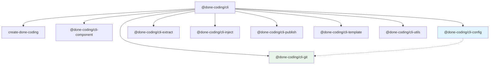

# done-coding-cli

🚀 **done-coding 命令行工具集** - 提供完整开发工作流支持的 monorepo 项目

[](https://opensource.org/licenses/MIT)
[](https://lerna.js.org/)

## 项目概述

done-coding-cli 是一个基于 Lerna 管理的 monorepo 项目，包含多个专业的命令行工具，旨在简化和标准化开发工作流程。每个工具都专注于特定的开发任务，可以独立使用或作为统一 CLI 的一部分。

## 包结构

### 主 CLI 工具

- **[@done-coding/cli](./packages/cli)** - 主命令行工具，集成所有子工具

### 核心工具包

- **[create-done-coding](./packages/create)** - 项目创建工具
- **[@done-coding/cli-component](./packages/component)** - 组件生成工具
- **[@done-coding/cli-config](./packages/config)** - 工程化配置工具
- **[@done-coding/cli-extract](./packages/extract)** - 信息提取工具
- **[@done-coding/cli-git](./packages/git)** - Git 跨平台操作工具
- **[@done-coding/cli-inject](./packages/inject)** - 信息注入工具
- **[@done-coding/cli-publish](./packages/publish)** - 项目发布工具
- **[@done-coding/cli-template](./packages/template)** - 模板处理工具

### 基础工具包

- **[@done-coding/cli-utils](./packages/utils)** - 通用工具库

## 快速开始

### 安装主 CLI 工具

```bash
# 全局安装
npm install -g @done-coding/cli

# 验证安装
DC --version
```

### 基本使用

```bash
# 创建新项目
DC create my-project

# 生成组件
DC component Button

# Git 操作
DC git status

# 查看所有可用命令
DC --help
```

## 开发环境设置

### 环境要求

- Node.js >= 18.0.0
- pnpm (推荐) 或 npm
- Git

### 克隆和安装

```bash
# 克隆仓库
git clone https://github.com/done-coding/done-coding-cli.git
cd done-coding-cli

# 安装依赖
pnpm install

# 构建所有包
pnpm run build
```

### 开发命令

```bash
# 开发模式（监听文件变化）
pnpm run dev

# 构建所有包
pnpm run build

# 运行测试
pnpm run test

# 代码检查
pnpm run lint

# 发布包
pnpm run push
```

## 项目架构

```
done-coding-cli/
├── packages/                 # 所有包的源码
│   ├── cli/                 # 主 CLI 工具
│   ├── create/              # 项目创建工具
│   ├── component/           # 组件生成工具
│   ├── config/              # 工程配置工具
│   ├── extract/             # 信息提取工具
│   ├── git/                 # Git 操作工具
│   ├── inject/              # 信息注入工具
│   ├── publish/             # 发布工具
│   ├── template/            # 模板工具
│   └── utils/               # 工具库
├── scripts/                 # 构建和发布脚本
├── lerna.json              # Lerna 配置
├── package.json            # 根包配置
└── pnpm-workspace.yaml     # pnpm 工作空间配置
```

## 包依赖关系



### 包间协作关系

- **@done-coding/cli-config** → **@done-coding/cli-git**:
  - config 包的 `merge-lint` 模块调用 git 包的 `check reverse-merge` 命令
  - 实现工程化配置中的 git 合并规范检测
- **所有子包** → **@done-coding/cli-utils**:
  - 提供通用的 CLI 工具函数和类型定义
  - 统一的配置文件读取和命令行参数处理

## 贡献指南

我们欢迎社区贡献！请遵循以下步骤：

### 贡献流程

1. **Fork 仓库**
2. **创建功能分支**: `git checkout -b feature/amazing-feature`
3. **提交更改**: `git commit -m "feat: add amazing feature"`
4. **推送分支**: `git push origin feature/amazing-feature`
5. **创建 Pull Request**

### 开发规范

- 遵循 [约定式提交](https://www.conventionalcommits.org/zh-hans/v1.0.0/) 规范
- 使用 ESLint 和 Prettier 保持代码风格一致
- 为新功能添加测试
- 更新相关文档

### 文档贡献

- 遵循项目现有的子包 README 模式
- 参考各子包的 README.md 作为模板

## 发布流程

项目使用 Lerna 进行版本管理和发布：

```bash
# 发布新版本
pnpm run push

# 查看变更日志
pnpm run log
```

## 许可证

MIT © [done-coding](https://github.com/done-coding)

## 相关链接

- [主 CLI 工具文档](./packages/cli/README.md)
- [项目仓库](https://github.com/done-coding/done-coding-cli)
- [更新日志](./CHANGELOG.md)

## 支持

如果您在使用过程中遇到问题：

1. 查看各包的 README 文档

---

**感谢使用 done-coding CLI 工具集！** 🎉
