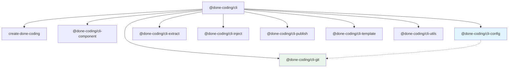

# @done-coding/cli

done-coding 命令行工具集 - 提供完整的开发工作流支持

[](https://www.npmjs.com/package/@done-coding/cli)
[](https://opensource.org/licenses/MIT)

## 安装

### 全局安装（推荐）

```bash
npm install -g @done-coding/cli
# 或使用 pnpm
pnpm add -g @done-coding/cli
```

### 本地安装

```bash
npm install @done-coding/cli
# 或使用 pnpm
pnpm add @done-coding/cli
```

## 快速开始

安装完成后，您可以使用以下命令启动：

### 安装后提示

根据您的操作系统，使用方式略有不同：

#### 可用命令

根据 package.json 的 bin 配置，以下命令在所有系统中都可用：

```bash
# 主要命令（推荐）
DC [命令]           # 大写 DC 命令
dc-cli [命令]       # 完整 CLI 命令
done-coding [命令]  # 完整品牌命令

# 查看帮助
DC --help
dc-cli --help
done-coding --help
```

⚠️ **重要提示**:

- 推荐使用大写的 `DC` 命令，在所有系统中都可用
- 可以使用 `dc-cli` 或 `done-coding` 作为替代命令
- **系统差异说明**:
  - **Windows 系统**: 可以使用小写 `dc` 命令（系统对大小写不敏感且无系统dc命令）
  - **macOS/Linux 系统**: 不建议使用小写 `dc` 命令（避免与系统dc命令冲突）

## 功能特性

- ✅ **统一入口**: 集成 10 个专业工具包，提供统一的命令行入口
- 🤖 **AI 对话**: 无子命令时唤起 AI 对话，支持多服务商、SSE 流式响应
- 🚀 **跨平台兼容**: 支持 Windows、macOS、Linux，自动处理系统差异
- 🔧 **模块化设计**: 每个子包独立开发，可单独使用或集成使用
- 📦 **完整工作流**: 涵盖项目创建、开发、构建、发布的完整流程
- 🔄 **包间协作**: 智能的包间功能调用，如 config 包调用 git 包的合并检测

## API 文档

@done-coding/cli 集成了多个工具，每个工具都专注于特定的开发任务：

### 🚀 项目创建

- **命令**: `DC create [projectName]`
- **描述**: 项目创建命令行工具
- **包地址**: [create-done-coding](https://www.npmjs.com/package/create-done-coding)
- **选项**:
  - `-c, --justCloneFromDoneCoding`: 是否仅仅从done-coding系列项目列表中克隆远程仓库

### 🔧 组件生成

- **命令**: `DC component`
- **描述**: 组件命令行工具
- **包地址**: [@done-coding/cli-component](https://www.npmjs.com/package/@done-coding/cli-component)

### ⚙️ 工程配置

- **命令**: `DC config`
- **描述**: 工程化配置命令行工具
- **包地址**: [@done-coding/cli-config](https://www.npmjs.com/package/@done-coding/cli-config)

### 📤 信息提取

- **命令**: `DC extract`
- **描述**: 信息提取命令行工具
- **包地址**: [@done-coding/cli-extract](https://www.npmjs.com/package/@done-coding/cli-extract)

### 🔄 Git 操作

- **命令**: `DC git`
- **描述**: git跨平台操作命令行工具
- **包地址**: [@done-coding/cli-git](https://www.npmjs.com/package/@done-coding/cli-git)

### 💉 信息注入

- **命令**: `DC inject`
- **描述**: 信息(JSON)注入命令行工具
- **包地址**: [@done-coding/cli-inject](https://www.npmjs.com/package/@done-coding/cli-inject)

### 📦 项目发布

- **命令**: `DC publish`
- **描述**: 项目发布命令行工具
- **包地址**: [@done-coding/cli-publish](https://www.npmjs.com/package/@done-coding/cli-publish)

### 🤖 AI 对话

- **命令**: `DC ai` 或直接输入 `DC`（无子命令）
- **描述**: AI 对话命令行工具
- **包地址**: [@done-coding/cli-ai](https://www.npmjs.com/package/@done-coding/cli-ai)

### 📝 模板处理

- **命令**: `DC template`
- **描述**: 预编译命令行工具
- **包地址**: [@done-coding/cli-template](https://www.npmjs.com/package/@done-coding/cli-template)

## 完整命令列表

### 基于实际 CLI 输出的命令

```bash
# 项目管理
DC create [projectName]                    # 创建新项目
DC create --justCloneFromDoneCoding       # 仅从done-coding系列项目克隆

# 组件管理
DC component add <name>                   # 新增组件
DC component remove [name]                # 删除组件
DC component list                         # 展示组件列表

# 工程化配置
DC config                                 # 工程化配置命令行工具

# 信息处理
DC extract                                # 信息提取命令行工具
DC inject                                 # 信息(JSON)注入命令行工具

# 模板处理
DC template                               # 预编译命令行工具

# Git 操作
DC git init                               # 初始化配置文件
DC git clone <platform> <username>       # 从选择的git平台克隆代码
DC git hooks <name> [args...]             # git钩子回调
DC git check <type>                       # 检查git操作

# 项目发布
DC publish                                # 项目发布命令行工具

# AI 对话
DC ai                                    # 进入 AI 对话
DC（无子命令后选 y）                       # 唤起 AI 对话
```

### 使用替代命令

```bash
# 使用完整命令名
dc-cli [command]                          # 完整CLI命令
done-coding [command]                     # 完整品牌命令
```

## 使用示例

### 创建新项目

```bash
# 使用主要命令
DC create
DC create my-app
DC create --justCloneFromDoneCoding

# 使用替代命令
dc-cli create my-app
done-coding create my-app
```

### 组件管理

```bash
# 使用主要命令
DC component add Button
DC component remove Button
DC component list

# 使用替代命令
dc-cli component add Button
done-coding component list
```

### Git 操作

```bash
# 使用主要命令
DC git init
DC git clone gitee username
DC git hooks pre-commit
DC git check reverse-merge

# 使用替代命令
dc-cli git init
done-coding git clone gitee username
```

### 模板处理

```bash
# 使用主要命令
DC template

# 使用替代命令
dc-cli template
done-coding template
```

### 项目发布

```bash
# 使用主要命令
DC publish

# 使用替代命令
dc-cli publish
done-coding publish
```

### AI 对话

```bash
# 方式一：DC 无子命令，选 y 进入 AI 对话
DC

# 方式二：DC ai 子命令
DC ai

# 方式三：直接指定 chat
DC ai chat
```

## 配置

您可以在项目根目录创建 `.done-coding.config.js` 文件来自定义配置：

```javascript
export default {
  // 默认模板路径
  templatePath: "./templates",

  // 组件生成配置
  component: {
    defaultType: "react",
    outputDir: "./src/components",
  },

  // Git 配置
  git: {
    autoCommit: true,
    commitTemplate: "conventional",
  },
};
```

## 架构设计

done-coding CLI 采用模块化架构，每个子包都是独立的工具：

### 包依赖关系



### 包间协作关系

- **@done-coding/cli-config** → **@done-coding/cli-git**:
  - config 包的 `merge-lint` 模块调用 git 包的 `check reverse-merge` 命令
  - 实现工程化配置中的 git 合并规范检测
- **所有子包** → **@done-coding/cli-utils**:
  - 提供通用的 CLI 工具函数和类型定义
  - 统一的配置文件读取和命令行参数处理

### 目录结构

```
@done-coding/cli (主包)
├── create-done-coding (项目创建)
├── @done-coding/cli-component (组件生成)
├── @done-coding/cli-config (工程配置)
├── @done-coding/cli-extract (信息提取)
├── @done-coding/cli-git (Git 操作)
├── @done-coding/cli-inject (信息注入)
├── @done-coding/cli-publish (项目发布)
├── @done-coding/cli-template (模板处理)
├── @done-coding/cli-ai (AI 对话)
└── @done-coding/cli-utils (工具库)
```

## 故障排除

### 常见问题

**Q: 命令找不到**

```bash
# 确保全局安装
npm list -g @done-coding/cli

# 重新安装
npm uninstall -g @done-coding/cli
npm install -g @done-coding/cli
```

**Q: 权限错误**

```bash
# macOS/Linux 使用 sudo
sudo npm install -g @done-coding/cli

# 或配置 npm 全局路径
npm config set prefix ~/.npm-global
```

**Q: 版本冲突**

```bash
# 清除缓存
npm cache clean --force

# 检查版本
DC --version
```

## 贡献指南

我们欢迎社区贡献！请查看各个子包的具体贡献指南：

- [项目创建工具](https://www.npmjs.com/package/create-done-coding)
- [组件生成工具](https://www.npmjs.com/package/@done-coding/cli-component)
- [更多工具](https://github.com/done-coding/done-coding-cli)

## 许可证

MIT © [done-coding](https://github.com/done-coding)

## 相关链接

- [Github 仓库](https://github.com/done-coding/done-coding-cli)
- [更新日志](./CHANGELOG.md)
